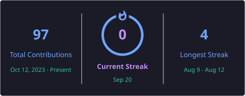

# 👋 Hiiii, I'm **Kaviraj K R**

### 🐍 Python | 🌐 Web Development | 🤖 Machine Learning

---

## 👨‍💻 About Me

🎓 **B.Tech graduate in Artificial Intelligence & Machine Learning**  
🏫 **Bannari Amman Institute of Technology**  
📊 **CGPA: 8.44 / 10**

I'm a Software Developer interested in building **practical and user-focused applications** using Python, web technologies, and machine learning.

I enjoy:

- 🧠 Solving programming and technical problems
- 🐍 Building applications with Python
- 🌐 Developing responsive web applications
- 🤖 Exploring Machine Learning and AI
- 🚀 Learning new technologies and improving my development skills

🎯 **Currently focused on:** Python · Web Development · Machine Learning

---

# 🛠️ Tech Stack

### 💻 Programming Languages

  

**Python · JavaScript · C++ · SQL**

---

### 🌐 Web Development

  

**HTML · CSS · React · Node.js · Express.js · Flask · Tailwind CSS**

---

### 🤖 Machine Learning & Data Science

  

**NumPy · Pandas · Scikit-learn · Matplotlib · TensorFlow · XGBoost**

---

### 🗄️ Databases

  

**MongoDB · MySQL · SQLite**

---

### 🔧 Tools & Platforms

  

**Git · GitHub · VS Code · Jupyter Notebook · Google Colab · Postman**

---

# 🚀 Featured Projects

## 📚 Learning Management System

### 🔐 MERN Stack · Role-Based Access Control

A full-stack **Learning Management System** designed to manage online learning with separate access levels for **Admin, Instructor, and Student**.

### ✨ Key Features

- 🔐 Role-based access control
- 👨‍💼 Admin, Instructor & Student workflows
- 📚 Course and content management
- 👥 User permission management
- 📊 Responsive dashboards
- 💻 Full-stack MERN architecture

### 🛠️ Tech Stack

`MongoDB` · `Express.js` · `React` · `Node.js`

🔗 **[View Repository →](https://github.com/kaviraj-1718/LMS1)**

---

## 🩺 Diabetes Risk Prediction System

### 🤖 Python · Machine Learning · Streamlit

A machine learning application that predicts **diabetes risk based on user-provided health parameters**.

### ✨ Key Features

- 📝 Health data input and validation
- 🧹 Data preprocessing
- 🤖 Multiple machine learning models
- 📊 Model evaluation and comparison
- ⚡ Diabetes risk prediction
- 🖥️ Interactive Streamlit interface

### 🧠 Machine Learning Models

`Logistic Regression` · `KNN` · `SVM` · `Decision Tree` · `Random Forest` · `XGBoost`

### 🛠️ Tech Stack

`Python` · `Pandas` · `NumPy` · `Scikit-learn` · `XGBoost` · `Streamlit`

🔗 **[View GitHub Projects →](https://github.com/kaviraj-1718?tab=repositories)**

---

# 📊 GitHub Statistics

---

# 📈 Contribution Activity

---

# 🤝 Let's Connect

I'm always open to connecting with developers, recruiters, and people 
working on interesting technology projects.

 

  

### 🚀 *Let's build something useful together!*

⭐ **Thanks for visiting my profile!**

